# RsyncOG: Cognitive Architecture System - Technical Architecture Overview

**Version:** 1.0  
**Date:** November 2025  
**Copyright:** 2025 OpenCog Cognitive Architecture Project

---

## Executive Summary

RsyncOG is a revolutionary extension of the rsync file synchronization utility that integrates OpenCog cognitive architecture capabilities. The system enables autonomous multi-agent orchestration for distributed AtomSpace cognitive architectures with HyperGNN swarm sync formations. This document provides a comprehensive technical architecture overview with formal specifications.

### Core Innovations

1. **Cognitive Knowledge Representation**: AtomSpace hypergraph for distributed sync topology
2. **Autonomous Multi-Agent System**: Specialized cognitive agents for orchestration, monitoring, and coordination
3. **Probabilistic Reasoning**: PLN (Probabilistic Logic Networks) for sync pattern inference
4. **Experience-Based Learning**: Historical performance tracking with adaptive behavior
5. **Distributed Cognition**: Synchronized AtomSpace across network nodes
6. **Swarm Intelligence**: HyperGNN swarm formations for coordinated synchronization

---

## 1. System Architecture Overview

### 1.1 High-Level Architecture

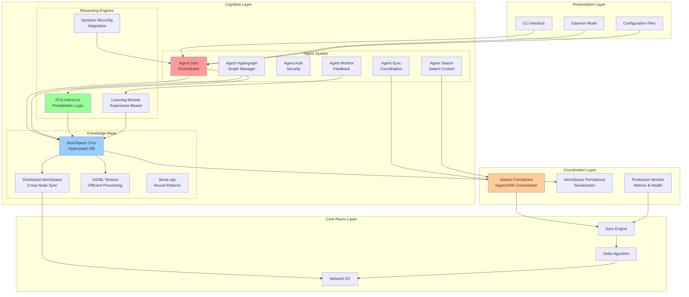

### 1.2 Component Layers

| Layer | Components | Responsibility |
|-------|-----------|----------------|
| **Presentation** | CLI, Daemon, Config | User interaction and initialization |
| **Cognitive** | Agents, PLN, Learning | Autonomous reasoning and decision-making |
| **Knowledge** | AtomSpace, Persistence | Distributed knowledge representation |
| **Coordination** | Swarm, Monitor | Multi-node orchestration |
| **Core** | Sync Engine, Delta, Network | File synchronization operations |

---

## 2. Cognitive Agent Architecture

### 2.1 Agent Interaction Diagram

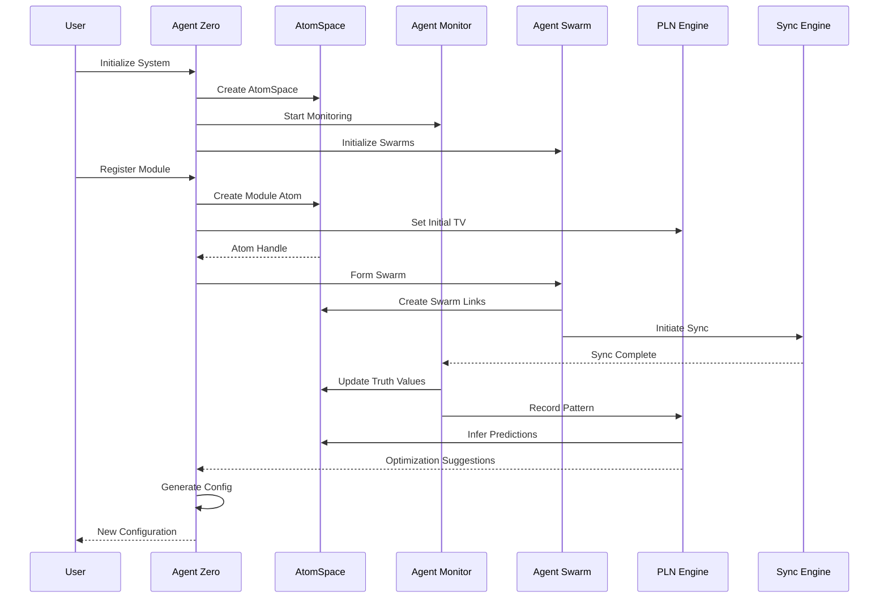

### 2.2 Agent Types and Capabilities

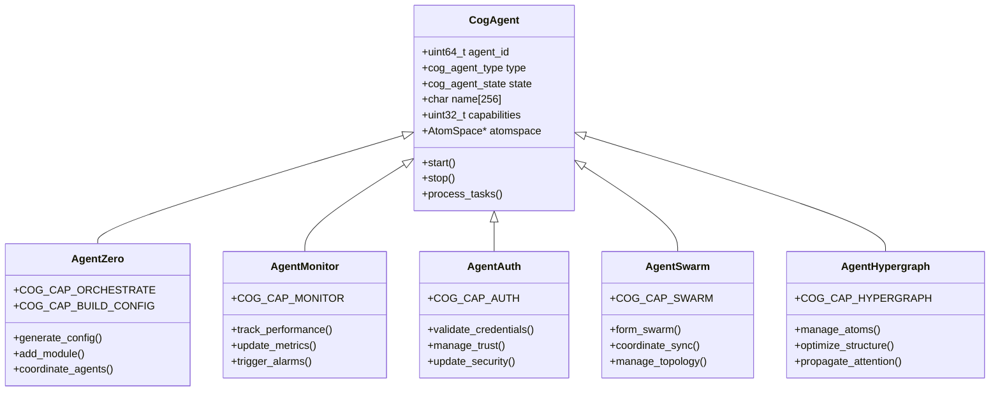

### 2.3 Agent Communication Protocol

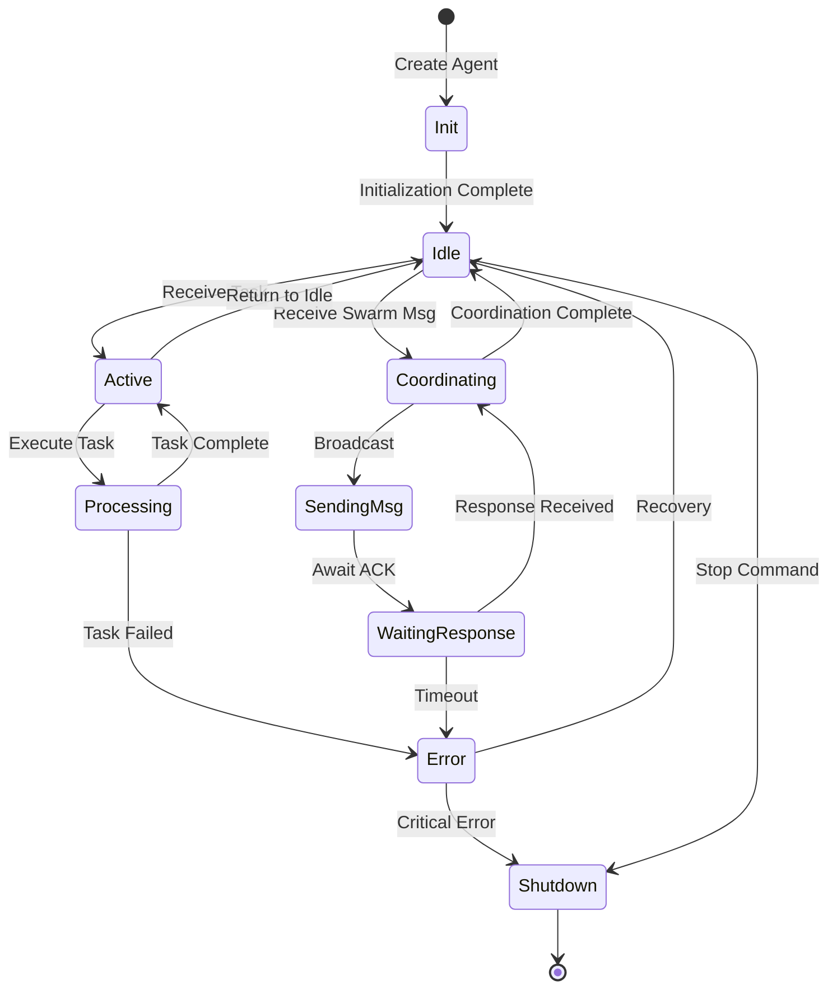

---

## 3. AtomSpace Hypergraph Architecture

### 3.1 AtomSpace Structure

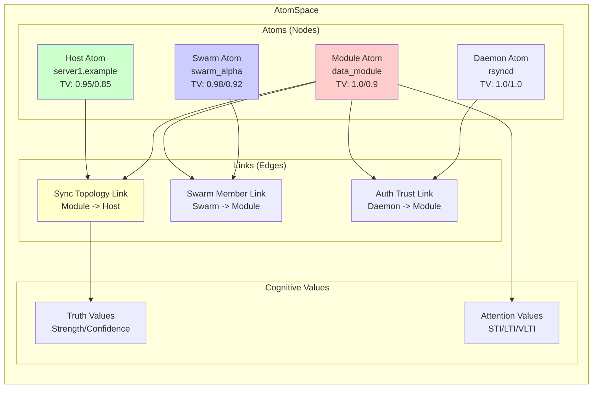

### 3.2 Atom Type Hierarchy

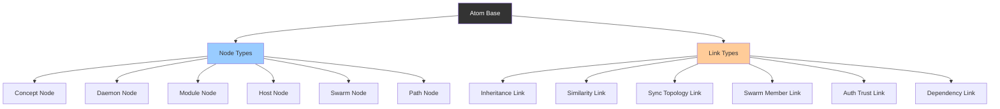

### 3.3 Truth Value and Attention Mechanism

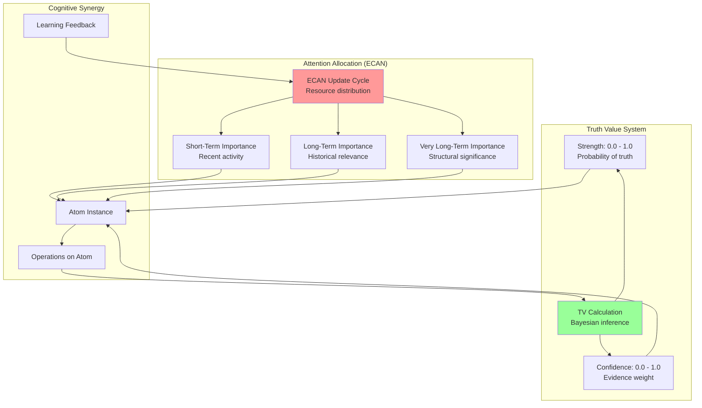

---

## 4. Data Flow Architecture

### 4.1 Sync Operation Data Flow

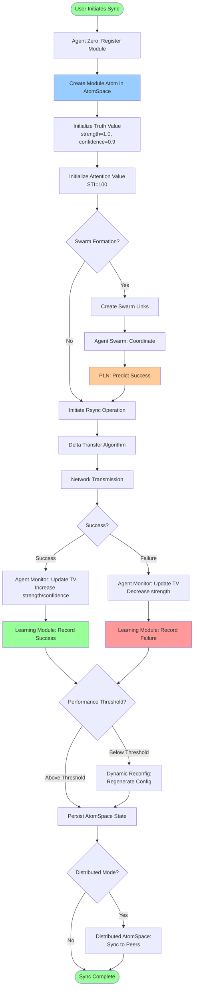

### 4.2 PLN Inference Data Flow

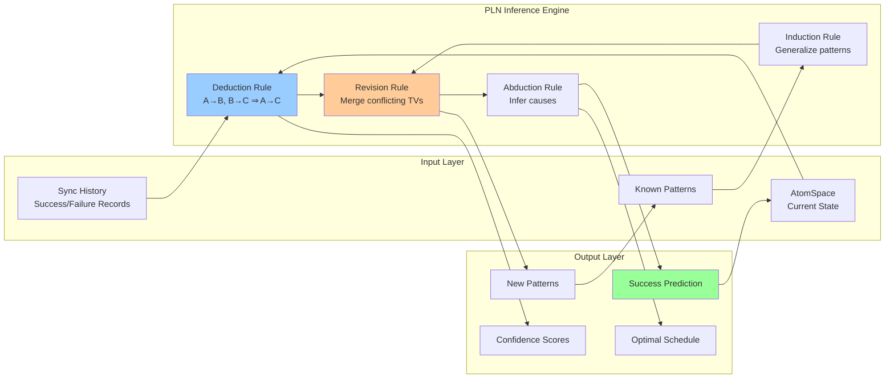

### 4.3 Learning Module Workflow

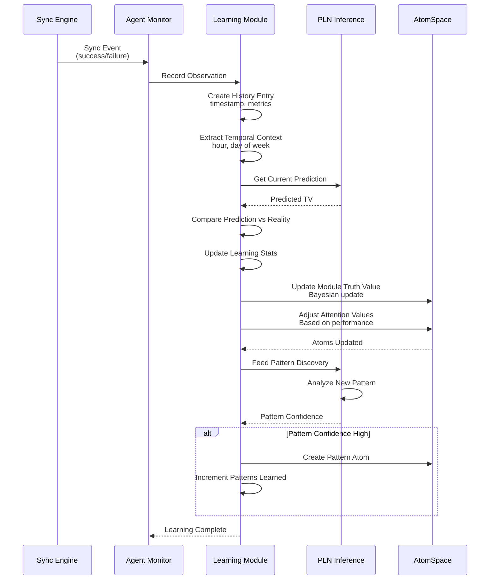

---

## 5. Swarm Formation Architecture

### 5.1 Swarm Lifecycle

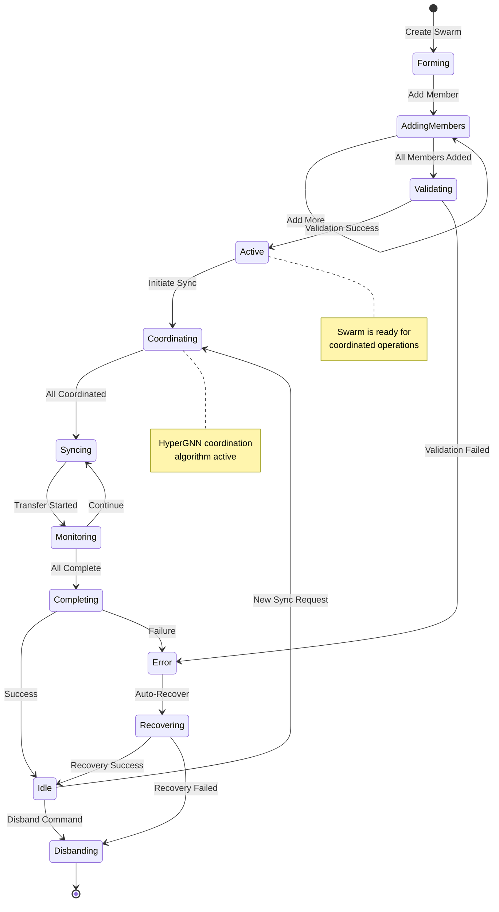

### 5.2 Swarm Topology

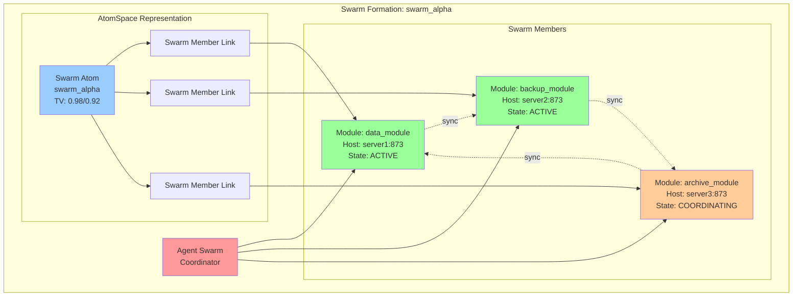

---

## 6. Distributed AtomSpace Architecture

### 6.1 Distributed Network Topology

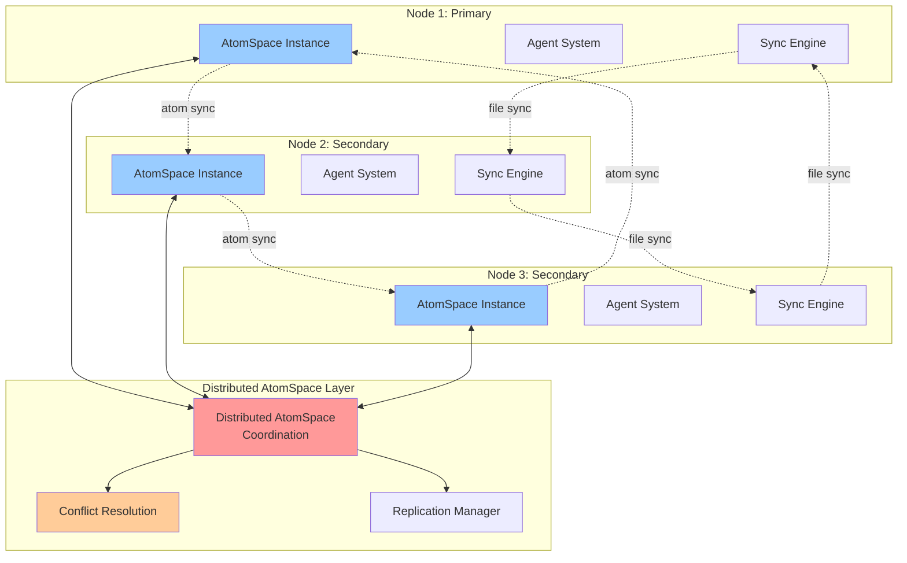

### 6.2 Conflict Resolution Strategies

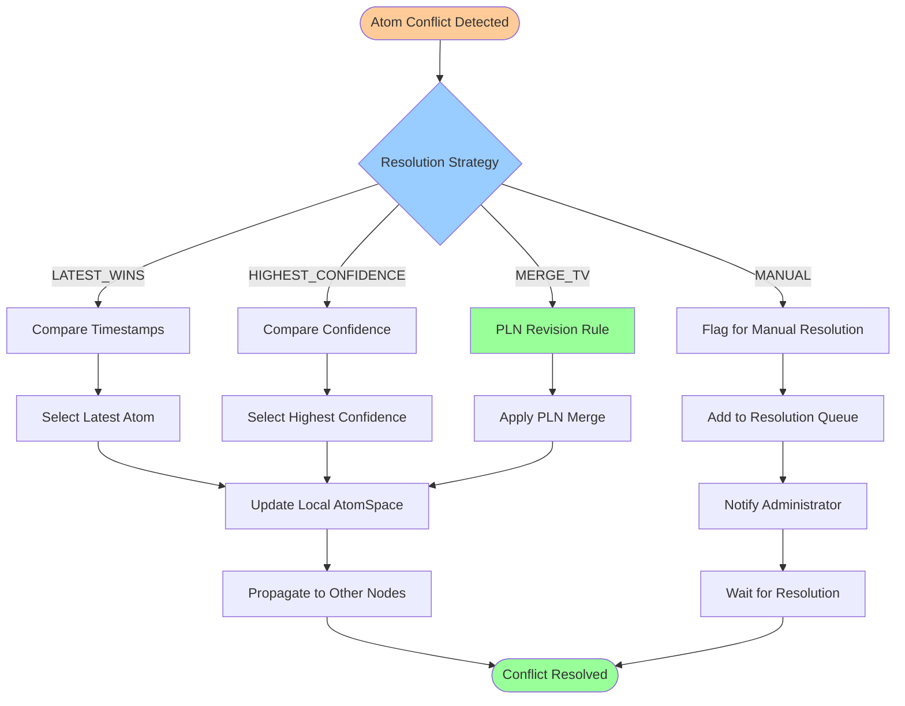

---

## 7. Technology Stack

### 7.1 Core Technologies

| Component | Technology | Purpose |
|-----------|-----------|---------|
| **Language** | C (C99 standard) | Core implementation |
| **Build System** | GNU Autoconf/Automake | Cross-platform compilation |
| **Knowledge Representation** | Hypergraph (Custom) | AtomSpace implementation |
| **Probabilistic Logic** | PLN (Custom) | Inference engine |
| **Serialization** | Binary Format | AtomSpace persistence |
| **Networking** | BSD Sockets | Distributed communication |
| **Math Library** | libm | Floating-point operations |
| **Optional: GGML** | GGML (External) | Tensor operations (stub) |
| **Optional: llama.cpp** | llama.cpp (External) | Neural patterns (stub) |

---

## Appendix A: Glossary

| Term | Definition |
|------|------------|
| **AtomSpace** | Hypergraph-based knowledge representation system |
| **Atom** | Node in the hypergraph representing a concept or entity |
| **Link** | Edge in the hypergraph connecting atoms |
| **Truth Value (TV)** | Probabilistic strength and confidence pair |
| **Attention Value (AV)** | Short/long-term importance values (STI/LTI/VLTI) |
| **PLN** | Probabilistic Logic Networks - inference engine |
| **ECAN** | Economic Attention Allocation Network |
| **Agent Zero** | Master orchestrator agent that generates configurations |
| **Swarm Formation** | Coordinated group of sync modules |
| **HyperGNN** | Hypergraph neural network for swarm coordination |
| **Cognitive Synergy** | Multiple cognitive processes working together |

---

**Document Version:** 1.0  
**Last Updated:** November 2025  
**Maintained By:** OpenCog Cognitive Architecture Project
